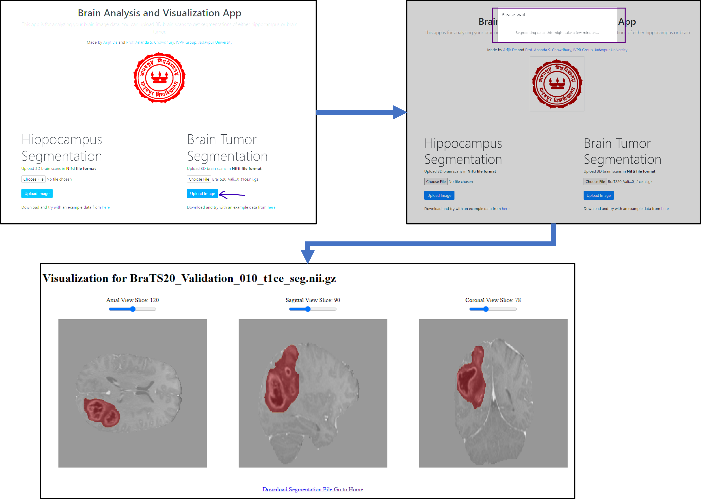

# 3D Brain Analysis and Visualization App
An app for segmenting brain tumors and hippocampi.

## Instructions to Run
1. `git clone https://github.com/arijitde92/Brain_Seg_App.git`
2. `cd Brain_Seg_App`
3. Create python environment of your choice (venv or conda) with python version 3.10
4. If your CUDA version is 12.2 then, `pip install -r requirements.txt` else install all requirements from `requirements.txt` except PyTorch. See [PyTorch Installation](https://pytorch.org/get-started/locally/) to separately install PyTorch according to your CUDA version.
5. `python app/app.py`

## Screenshot of the App
Following image shows how to upload and visualize a segmented brain tumor.

